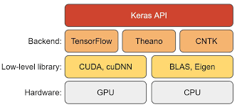
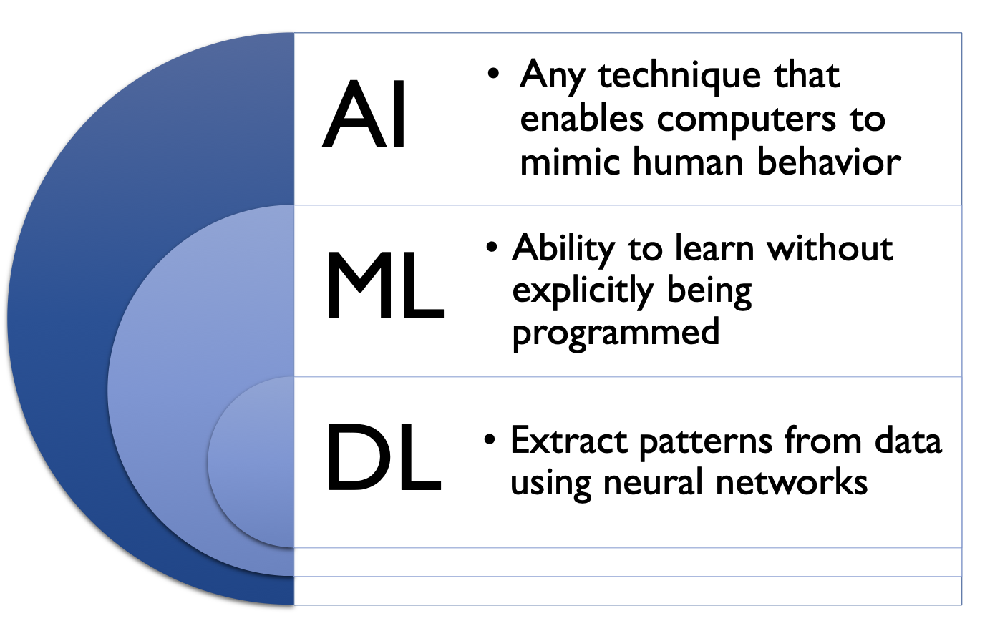
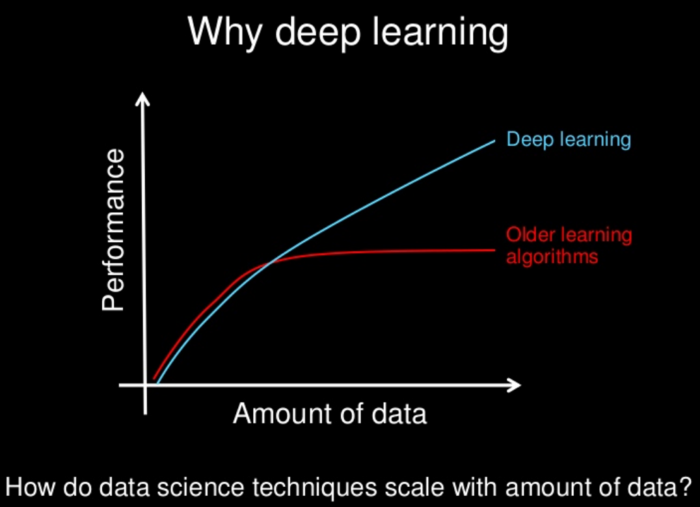

# Keras Playground

> <http://keras.io>

Keras is a high-level neural networks API, written in Python and capable of running on top of TensorFlow, CNTK, or Theano. It was developed with a focus on enabling fast experimentation.
Keras is supported on CPU, GPU, and TPU.

 

### What is Deep Learning?

Deep learning is a class of machine learning algorithms that uses multiple layers to progressively extract higher level features from the raw input. These algorithms learn multiple levels of representations that correspond to different levels of abstraction.

 

### Artificial Intelligence / Machine Learning / Deep Learning

 

### Artificial Intelligence (AI)

In computer science, artificial intelligence (AI), sometimes called machine intelligence, is intelligence demonstrated by machines, in contrast to the natural intelligence displayed by humans and other animals. AI systems perform tasks that normally require human intelligence, such as visual perception, speech recognition, decision-making, and translation between languages.

 

### Machine Learning

Machine Learning is a field of artificial intelligence that focuses on developing algorithms and techniques that allow computers to learn from and make predictions or decisions based on data.

For example, through machine learning, we can train a system to identify whether incoming emails are spam or not.

 

### What is the difference between `Data Mining` and `Machine Learning`?

**Machine Learning** involves the automated extraction of information using carefully authored algorithms and assigning AI patterns on a specific area of interest. It focuses on prediction based on known properties learned from training data.

On the other hand, **Data Mining** requires human intervention to apply machine learning methodologies on specific datasets, in order to improve or deduct new classification patterns. It focuses on discovering unknown properties in the data.

 

### Deep Learning

Deep Learning is a subfield of machine learning concerned with algorithms inspired by the structure and function of the brain called artificial neural networks. These neural networks attempt to simulate the behavior of the human brain to "learn" from large amounts of data.

 

### Features of Keras

- The same code can be executed on both CPU and GPU.
- It has an easy-to-use API that allows for quick prototyping of deep learning models.
- It supports Convolutional Neural Networks (for computer vision) and Recurrent Neural Networks (for sequence processing), which can be freely combined.
- Any network architecture can be created, including multi-input or multi-output models, layer sharing, and model sharing.
- From GANs (Generative Adversarial Networks) to Neural Turing Machines, Keras is basically suitable for any deep learning model.
- It offers consistent and simple APIs, minimizing the number of user actions required for common use cases.
- It provides clear and actionable feedback upon user error.
- It has extensive documentation and developer guides to help users get started quickly.
